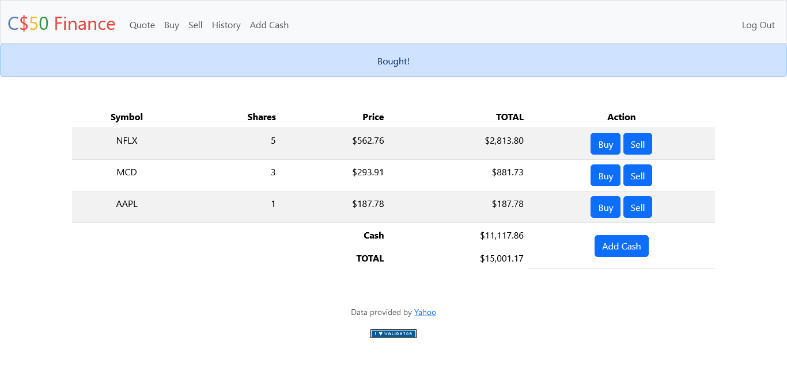

# cs50x-2024-pset9-finance

This repository contains the code for CS50's Finance problem set, a web application for managing a simulated stock portfolio. Users can track their holdings, view real-time stock prices, and buy/sell stocks (without real-money transactions).

# Features
Portfolio Management: Users can register and create a portfolio to track their owned stocks.
Real-Time Stock Prices: The application retrieves and displays current stock prices using an external API.
Simulated Trading: Users can buy and sell stocks within their portfolio, updating their holdings and cash balance.
Portfolio Valuation: The application calculates the total value of a user's portfolio based on current stock prices.
# Technologies Used
# Backend: Flask (web framework)
# Frontend: HTML, CSS (optional styling)
# Database: SQLite (data storage for user portfolios)
# External API: IEX Cloud or Yahoo Finance (for stock price data)
# Getting Started
Clone this repository:
Markdown
git clone https://github.com/<your-username>/cs50-finance.git
Use code with caution.
Install dependencies:
Markdown
python3 -m venv .venv
source .venv/bin/activate
pip install -r requirements.txt
Use code with caution.
Configure API Key:
Create an account with IEX Cloud or Yahoo Finance (depending on the chosen API).
Obtain your API key.
Create a file named api.py and store your API key securely within it.
Run the application:
Markdown
export FLASK_APP=application.py
flask run
Use code with caution.
This will launch the application on http://127.0.0.1:5000/ in your web browser.

Usage
Register: Create a new account to start tracking your portfolio.
View Portfolio: The homepage displays your owned stocks, number of shares, current price, and total value for each holding.
It also shows your remaining cash balance and the total portfolio value.
Search Stocks: Enter a stock symbol to look up its current price.
Buy/Sell Stocks: Use the provided form to simulate buying or selling shares of a stock.
Additional Notes
This application is for educational purposes and does not involve real-money transactions.
The code utilizes error handling and user input validation for a robust user experience.
Contributing
Feel free to fork this repository and contribute your improvements!

Happy coding!
